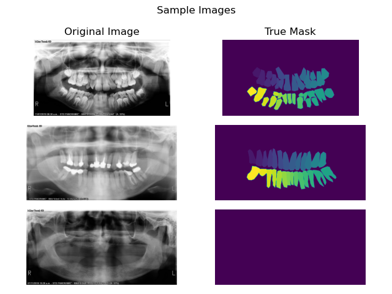
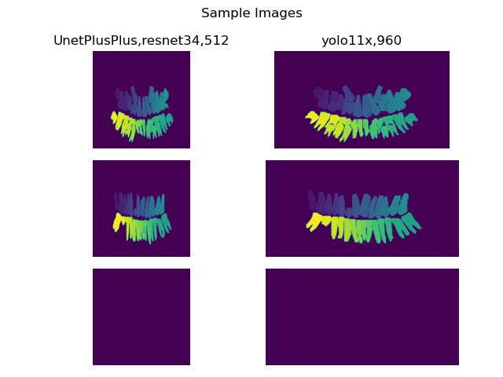
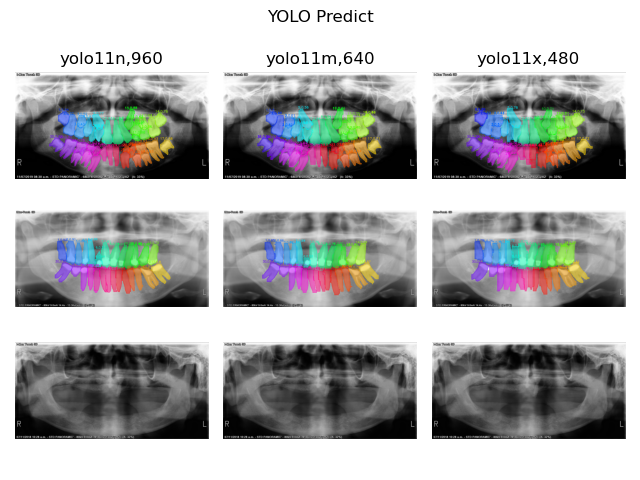

# Teeth Segmentation on Panoramic Dental X-rays

Deep learning-based semantic segmentation of teeth in panoramic dental X-ray images using U-Net variants and YOLO segmentation models.

This repository includes:
- Training pipelines
- Evaluation scripts
- Inference examples
- Multiple segmentation architectures
- Dice and IoU metrics


---
## 🧠 Model Architecture

Current supported models:


- UNet++
- YOLOv11

## ⚙️ Installation

Clone repository:
```git
git clone https://github.com/chamani-parisa-1375/Teeth_segmentation_xray.git
cd Teeth_segmentation_xray
```
Create environment:
```aiignore
python -m venv venv
source venv/bin/activate
```
Install dependencies:
```aiignore
pip install -r requirements.txt
```
## 🗂 Dataset

download Teeth Segmentation Dental X-rays from <a href=https://www.kaggle.com/datasets/humansintheloop/teeth-segmentation-on-dental-x-ray-images>
hear.</a> 

#### Examples of samples from the dataset:


## 🚀 Training
Unet++:
```aiignore
python train_unet.py
```
Yolo:
```aiignore
python train_yolo.py
```

## 📊 Model Performance Comparison

The table below compares the performance of different segmentation models using IoU and Dice metrics across multiple image sizes.

* Among the tested models, **YOLO11x (960)** achieved the best performance with an **IoU of 0.75** and a **Dice score of 0.82**.
* Increasing image size generally improved segmentation accuracy for all YOLO variants.
* Lightweight models such as **YOLO11n** provided competitive performance while maintaining lower computational cost.
* U-Net based architectures showed lower accuracy compared to YOLO models in this experiment.

These results demonstrate that larger YOLO11 variants and higher input resolutions can significantly improve segmentation quality.

| ModelName | ImageSize | Iou | Dice |
| --- | --- | --- | --- |
| UnetPlusPlus,efficientnet-b3 | 256 | 0.57 | 0.65 |
| UnetPlusPlus,efficientnet-b5 | 256 | 0.57 | 0.65 |
| UnetPlusPlus,resnet34 | 512 | 0.6 | 0.67 |
| yolo11m | 480 | 0.7 | 0.78 |
| yolo11m | 640 | 0.72 | 0.79 |
| yolo11m | 960 | 0.74 | 0.8 |
| yolo11n | 480 | 0.63 | 0.71 |
| yolo11n | 640 | 0.69 | 0.76 |
| yolo11n | 960 | 0.72 | 0.78 |
| yolo11x | 480 | 0.71 | 0.79 |
| yolo11x | 640 | 0.73 | 0.81 |
| yolo11x | 960 | 0.75 | 0.82 |

#### Showing the difference between U-Net and YOLO predictions:


#### YOLO prediction sample:


---
## 📜 Citation

If you use this project in your research or work, please cite:

```bibtex
@misc{teeth_segmentation_xray,
  author = {Parisa Chamani},
  title = {Teeth Segmentation on Panoramic Dental X-rays},
  year = {2026},
  publisher = {GitHub},
  howpublished = {\url{https://github.com/chamani-parisa-1375/Teeth_segmentation_xray}}
}
````


